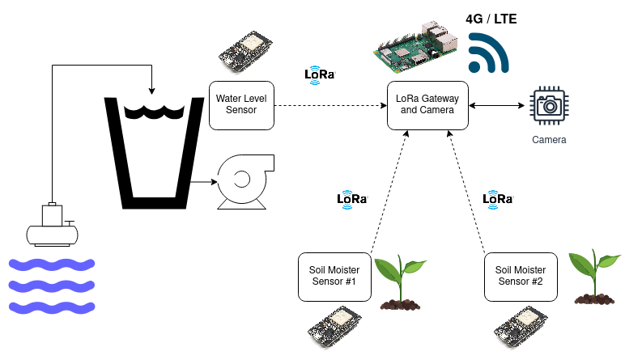
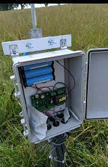

# farm-monitoring-lora
The irrigation monitoring system using IoT sensor with LoRa comm. ESP32 are used for LoRa node as sensor, RPi3 is used for LoRa gateway and Camera interface.

## Hardware Diagram
  

## Brief idea for installation
  

### Soil Moisture SensorNode(s)
The tasks for these node consist of:
- Read the soil moisture capacitive sensor by using ADC and convert into soil moisture value (Need a calibration process).  
- Send the moisture value to the LoRa gateway (RPi node)
- Battery monitoring, by reading the battery voltage with ADC + voltage divider.

### Waterlevel Monitoring SensorNode
The tasks for this node consists of:
- Read the status of watertank's float switch
- Send the state of the switch to LoRa gateway.
- Battery monitoring. 

### LoRa Gateway
The task for the LoRa gateway consists of:
- Receive all the LoRa data from sensor nodes
- Pack all data into a JSON format and publish the data to MQTT broker
- Handle the SIM7600 Dongle for 4G connection.
- Webcam server by using CSI camera.
