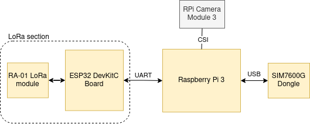

## LoRa Gateway
Raspberry Pi 3 is used for the LoRa gateway for the system. It consists of:
- RA-01 + ESP32 for the LoRa module of Pi
- SIM7600G-H USB dongle for 4G module
- Raspberry Pi Camera Module 3

## HW Diagram of the Gateway
  

## MQTT Worker using Python
### Installation of all dependencies
## Camera Worker using Python
### Installation of all dependencies
