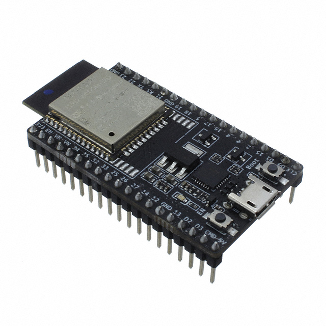
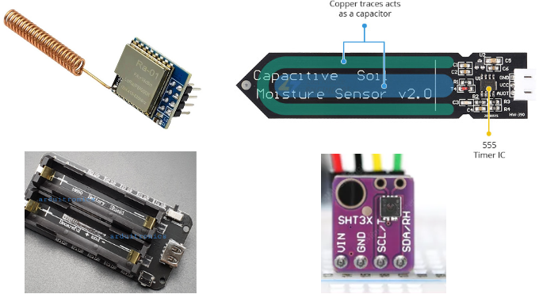
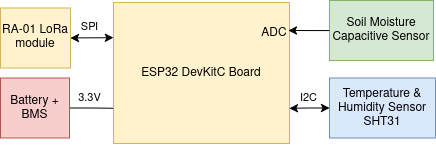

## Sensor Nodes
The sensor node(s) are based on ESP32 microcontroller with LoRa module. The hardware consists of:
- ESP32 DevKit-C
  
- RA-01 LoRa module (SX1278)
- Soil Moisture Capacitive Sensor
    https://lastminuteengineers.com/capacitive-soil-moisture-sensor-arduino/
- SHT31 Temperature & Humidity Sensor
    https://lastminuteengineers.com/sht31-temperature-humidity-sensor-arduino-tutorial/
- Li-on Battery + BMS
  

## Hardware Diagram of Sensor Node
  

## ESP32 GPIO pinout for sensor node
#### LoRa Module RA-01
- MOSI -> 23
- MISO -> 19
- SCK -> 18
- CS -> 5
- RST -> 15
- IRQ -> 2

#### SHT31 Air temperature & humidity sensor
- SCL -> 22
- SDA -> 21

#### Soil Moisture Capacitive Sensor
- ADC -> 34

#### Serial Interface with Pi (Only for gateway device)
- RXD -> 16
- TXD -> 17
